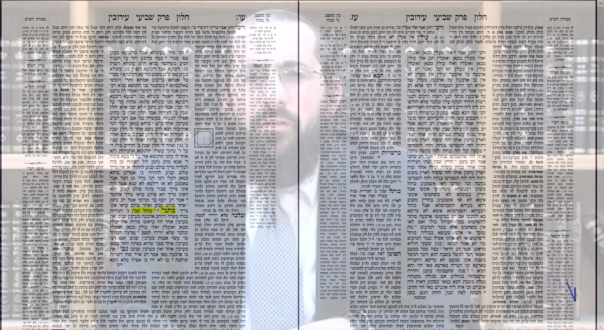
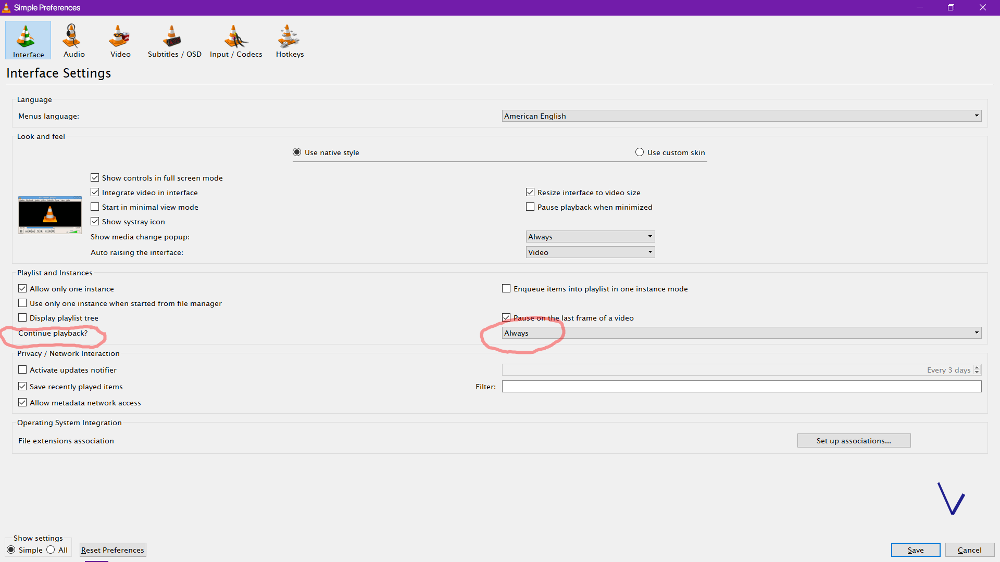

# Daf Yomi

Abre Daf Yomi de la página de [Jabrutouch](https://www.jabrutouch.com/estudia)
- PDF con el Daf
- Video con la explicación del Jajam

## Funciones

- Transparencia
    
- Apuntes
    

## Requisitos

- Descargar e instalar [VLC Player](https://www.videolan.org/vlc/download-windows.html)
- Descargar e instalar [SumatraPDF](https://www.sumatrapdfreader.org/download-free-pdf-viewer.html) (recomendado) o cualquier otro lector PDF
- Descargar e instalar [Typora](https://typora.io/#windows) (recomendado) o cualquier otro editor para [Markdown](https://en.wikipedia.org/wiki/Markdown)

## Cómo iniciar

1. Descargar `OpenDafYomi.exe`
2. Ejecutar `OpenDafYomi.exe`

## Atajos del teclado en el PDF

| Tecla                     | Función       |
| ------------------------- | ------------- |
| `Control+Izquiera`        | Retroceder *  |
| `Control+Derecha`         | Adelantar *   |
| `Control+Espacio`         | Pausar *      |
| `Control+t`               | Transparencia |
| `Control+a` o `Control+n` | Apuntes       |

*_Para que funcionen los atajos en el video se requiere [VLC Player](https://www.videolan.org/vlc/download-windows.html)_

## Recomendaciones

- Usted puede programar la ejecución diaria de este programa con el [Planificador de tareas de Windows](https://es.wikipedia.org/wiki/Planificador_de_tareas_(Windows))
- Es posible configurar VLC para guardar la posición previa en el video
    